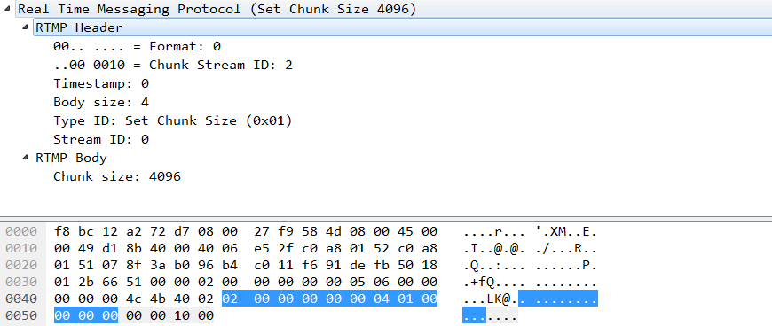

# 2.3.1、设置块大小(Type ID = 1)

> 协议控制消息（1），设置块大小，被用来通知对方新的最大的块大小。默认最大的块大小为 128 字节，客户端和服务器可以使用此消息来修改默认的块大小。例如，假设客户端想要发送的音频数据大小为131 字节，而块大小为 128 字节。在这种情况下，客户端可以通知服务器新的块大小为 131 字节，然后就可以使用一个块来发送完整的音频数据了。最大的块大小至少为 128 字节，块至少携带 1 个字节的内容。通信的每一个方向（例如从客户端到服务器）拥有独立的块大小设置。

```java
     0                   1                   2                   3
     0 1 2 3 4 5 6 7 8 9 0 1 2 3 4 5 6 7 8 9 0 1 2 3 4 5 6 7 8 9 0 1
    +-+-+-+-+-+-+-+-+-+-+-+-+-+-+-+-+-+-+-+-+-+-+-+-+-+-+-+-+-+-+-+-+
    |0|                     chunk size (31 bits)                    |
    +-+-+-+-+-+-+-+-+-+-+-+-+-+-+-+-+-+-+-+-+-+-+-+-+-+-+-+-+-+-+-+-+
            Payload for the ‘Set Chunk Size’ protocol message
```

\#注释：

* 0：当前比特位必须为零。
* chunk size(31 bits): This field holds the new maximum chunk size, in bytes, which will be used for all of the sender's subsequent chunks until further notice. Valid sizes are 1 to 2147483647(0x7FFFFFFF) inclusive; however, all sizes greater than 16777215(0xFFFFFF) are equivalent since no chunk is larger than onemessage, and no message is larger than 16777215 bytes.
* 块大小（31比特）：本字段标识了新的最大块大小，以字节为单位，发送端之后将使用此值作为最大的块大小。本字段的有效值为 1 - 2147483647(0x7FFFFFFF)，由于消息的最大长度为 16777215(0xFFFFFF)，而一个块最多只能携带一条消息，因此本字段的实际有效值为 1\~16777215(0xFFFFFF)。

