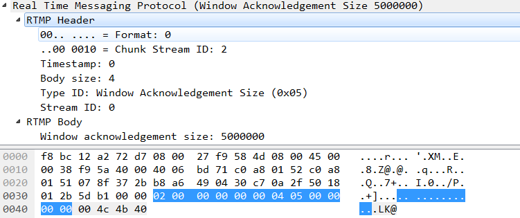

# 2.3.3、应答窗口大小(type id = 5)


> 客户端和服务器发送这个消息来通知对方应答窗口的大小。发送方在发送了等于窗口大小的数据之后，等待接收对方的应答消息（在接收到应答之前停止发送数据）。接收方必须发送应答消息，在会话开始时，或从上一次发送应答之后接收到了等于窗口大小的数据。

```java
     0                   1                   2                   3
     0 1 2 3 4 5 6 7 8 9 0 1 2 3 4 5 6 7 8 9 0 1 2 3 4 5 6 7 8 9 0 1
    +-+-+-+-+-+-+-+-+-+-+-+-+-+-+-+-+-+-+-+-+-+-+-+-+-+-+-+-+-+-+-+-+
    |                   Acknowledgement Window size (4 bytes)       |
    +-+-+-+-+-+-+-+-+-+-+-+-+-+-+-+-+-+-+-+-+-+-+-+-+-+-+-+-+-+-+-+-+
     Payload for the ‘Window Acknowledgement Size’ protocol message
```



