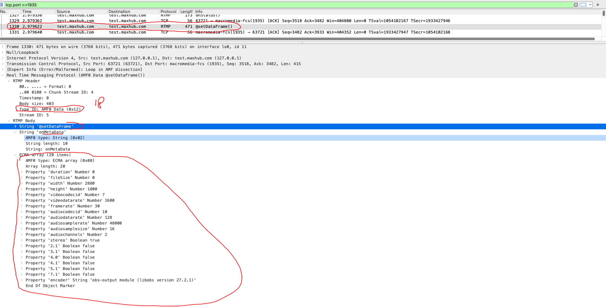

# 第8章、数据消息 Data Message （type ID = 15 或 18）

Data Message（数据消息，Message Type ID = 15 或 18）：传递一些元数据（Metadata，比如视频名，分辨率等等）或者用户自定义的一些消息。当信息使用 AMF0 编码时，Message Type ID = 18，AMF3 则为15，元数据包含了（音视频）数据的细节信息，像流的创建时间，时间点，主题等等,如下：



```java
Frame 1330: 471 bytes on wire (3768 bits), 471 bytes captured (3768 bits) on interface lo0, id 11
Null/Loopback
Internet Protocol Version 4, Src: test.maxhub.com (127.0.0.1), Dst: test.maxhub.com (127.0.0.1)
Transmission Control Protocol, Src Port: 63721 (63721), Dst Port: macromedia-fcs (1935), Seq: 3518, Ack: 3482, Len: 415
[Expert Info (Error/Malformed): Loop in AMF dissection]
Real Time Messaging Protocol (AMF0 Data @setDataFrame())
    RTMP Header
    RTMP Body
        String '@setDataFrame'
        String 'onMetaData'
        ECMA array (20 items)
            AMF0 type: ECMA array (0x08)
            Array length: 20
            Property 'duration' Number 0
            Property 'fileSize' Number 0
            Property 'width' Number 2880
            Property 'height' Number 1800
            Property 'videocodecid' Number 7
            Property 'videodatarate' Number 1600
            Property 'framerate' Number 30
            Property 'audiocodecid' Number 10
            Property 'audiodatarate' Number 128
            Property 'audiosamplerate' Number 48000
            Property 'audiosamplesize' Number 16
            Property 'audiochannels' Number 2
            Property 'stereo' Boolean true
            Property '2.1' Boolean false
            Property '3.1' Boolean false
            Property '4.0' Boolean false
            Property '4.1' Boolean false
            Property '5.1' Boolean false
            Property '7.1' Boolean false
            Property 'encoder' String 'obs-output module (libobs version 27.2.1)'
            End Of Object Marker
```
